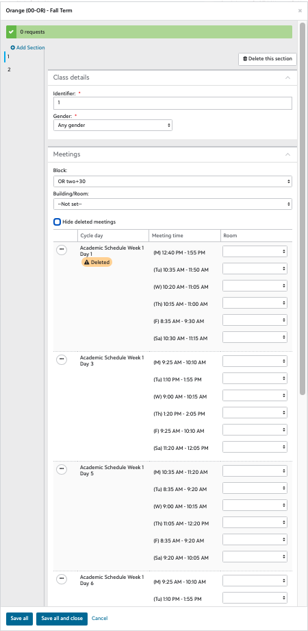

# Carousel Daily Schedule

Display a webcal feed graphically on a web page, to be displayed on our digital signage. The formatting is customized for the Groton daily schedule feed.

## Basic idea

There are classes created for each color block with the user `Carousel Daily Schedule` as the student. These are the only classes that that account is enrolled in. Carousel (the app) sends a request to the app running on GAE to parse and display the “student”’s class schedule, with a decent interval (15-30 seconds) for it to run and render the page.

As the registrar updates the daily schedule, it changes when the class block classes meet, so the student’s schedule updates, so each time the schedule is redrawn, it reflects the latest schedule data in the system.

## Setup

Clone the repo, install dependencies, configure a location to host the app (the `setup` script is configured to host it in Google App Engine, but uploading it anywhere that can host HTML should work).

```sh
git clone https://github.com/groton-school/carousel-daily-schedule.git path/to/repo
cd path/to/repo
npm install
npm run setup
```

## Configure

- Create a dedicated `Carousel Digital Signage` (or equivalent) student user, and one class per scheduled block.
- Enroll the student in each of the classes (see Cunning Tricks below)
- Get the webcal feed for the student's personal schedule from the Blackbaud LMS

Navigate to the hosted app location `https://example.com/path/to/app` and use path parameters:

| param              | value                                                                                                                                                                                   |
| ------------------ | --------------------------------------------------------------------------------------------------------------------------------------------------------------------------------------- |
| `ics`              | URL of an ICS/webcal feed                                                                                                                                                               |
| `initialDate`      | A fixed starting date to view (in ISO 8601 format: `YYYY-MM-DD`)                                                                                                                        |
| `message`          | A message to be displayed in the event of no calendar events being loaded                                                                                                               |
| `title`            | A title to replace the date header (although the date header can be be included using the placeholder `{{Date}}` -- which, url-encoded is `%7B%7BDate%7D%7D`)                           |
| `defaultColor`     | By default events that are not color blocks are displayed gray, this default color can be changed (for example to `var(--groton-red)` which is url-encoded as `var%28--groton-red%29`)  |
| `svgText`          | Rendering the event title text as SVG (true by default) causes it to more completely fill the event box. However, omitting the `svgText` allows it to word-wrap better: `svgText=false` |
| `forceDisplayTime` | Ignore the check to see if the time is very, very brief (less than 30 minutes during the regular year, less than 45 minutes during GRACE) and display the time                          |

e.g. `https://example.com/path/to/app?ics=https://example.myschoolapp.com/path/to/student/webcal/feed`

## Annual maintenance

The `Carousel Daily Schedule` user needs to be enrolled each year as an underclassmen (or, at least, not a senior) so that the registrar doesn’t have to deal with its non-existent transcript.

The user needs to be enrolled in the GRACE summer program blocks in mid-June, before GRACE starts. This will require creating new sections of

W Block
X Block
Y Block
Z Block

In addition, for GRACE, the user needs to be enrolled in…

Breakfast
Lunch
Dinner
Check-in
Study Hall
Activity Options
Study Hall or Group Outing
Group Activity

The user needs to be enrolled in the Academic Year blocks (which need to be created, per Cunning Tricks below) in mid-August, before the academic year starts.

The user should be automatically enrolled by the Registrar with all other students in activity blocks for the academic year.

## Cunning tricks

- We have settled on showing the maximum amount of time for a block, rather than trying to show a block and its matching +30 extension separately. To do this…
- Each color block class will likely have two sections: one section that is, say “OR one+30” for which the `OR two+30` extended block day is deleted, and another section that is “OR two+30” that meets only on the `OR two+30` extended block day.

<a href="./doc/calendar.png"></a>

<table>
  <tr>
    <td>
      <a href="./doc/enrollment-config-1.png"></a>
    </td>
    <td>
      <a href="./doc/enrollment-confg-2.png"></a>
    </td>
  </tr>
</table>

## Caveats

- It can take an indeterminate amount of time (~1 hour, perhaps) for changes in myGroton block schedules to be reflected in the myGroton calendar feeds.
- There is a bunch of tweaky one-off stuff done to make the GRACE schedule appear nicely that should probably be double-checked each year.
- Processing of the actual feed is managed by the isGRACE flag
- `.w-block`, `.x-block`, `.y-block`, `.z-block`, `.activity`, `.group`, `.study-hall` (i.e. all secondary CSS style selectors) are for GRACE.
- The student account will graduate in 2027, and will need to be reenrolled.
